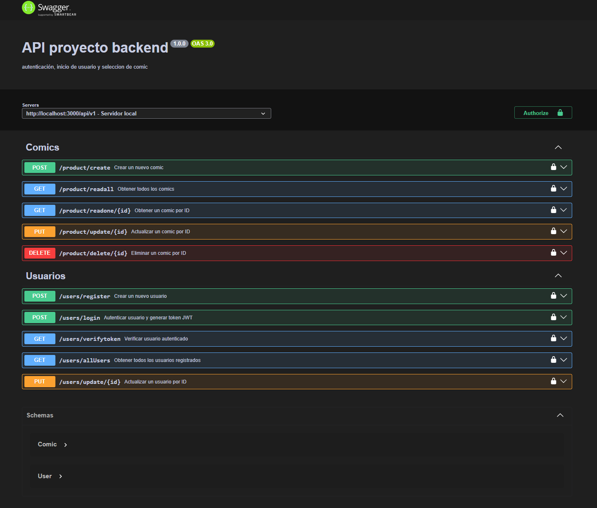

# Proyecto 6 - Aplicación Backend con Autenticación

## Estructura de carpetas

```
6_proyecto_backend
├─ node_modules
├─ src
│   ├─ config
│   │   └─ db.js
│   ├─ controllers
│   │  ├─ product.controller.js
│   │  └─ user.controller.js
│   ├─ img
│   │  └─ swagger.jpg
│   ├─ middleware
│   │  └─ authorization.js
│   ├─ models
│   │  ├─ Product.js
│   │  └─ User.js
│   ├─ routes
│   │  ├─ user.routes.js
│   │  └─ product.routes.js
│   ├─ swagger
│   │  └─ swagger.js
│   └─ server.js
├─ .env
├─ .gitignore
├─ package-lock.json
├─ package.json
└─ README.md
```

## Swagger

Documentación completa de la API en el siguiente enlace:

[https://six-proyecto-aplicacion-backend-con.onrender.com/api-docs/#](https://six-proyecto-aplicacion-backend-con.onrender.com/api-docs/#)




## API's

Apis usados en el proyecto

**Crear usuario**

```
https://six-proyecto-aplicacion-backend-con.onrender.com/api/v1/users/register
```

**Logear usuario**

El tiempo de expiración del token es de 60 segundos, para realizar pruebas.

```
https://six-proyecto-aplicacion-backend-con.onrender.com/api/v1/users/login
```

**Verificar token usuario logeado**

```
https://six-proyecto-aplicacion-backend-con.onrender.com/api/v1/users/verifytoken
```

**Obtener todos los usuarios**

```
https://six-proyecto-aplicacion-backend-con.onrender.com/api/v1/users/allUsers
```

**Actualizar usuario según su ID**

```
https://six-proyecto-aplicacion-backend-con.onrender.com/api/v1/users/update/68c3a6a5be12aeba7e4507da
```

## Producto - Comic

**Crear producto comic**

```
https://six-proyecto-aplicacion-backend-con.onrender.com/api/v1/product/create
```

**Obtener todos los comic**

```
https://six-proyecto-aplicacion-backend-con.onrender.com/api/v1/product/readall
```

**Obtener un comic según su ID**

```
https://six-proyecto-aplicacion-backend-con.onrender.com/api/v1/product/readone/68c3a871be12aeba7e4507dc
```

**Actualizar comic según su ID**

```
https://six-proyecto-aplicacion-backend-con.onrender.com/api/v1/product/update/68c3a871be12aeba7e4507dc
```

**Eliminar comic según su ID**

```
https://six-proyecto-aplicacion-backend-con.onrender.com/api/v1/product/delete/68c3a871be12aeba7e4507dc
```

❤️ Este código fue desarrollado por **Marco Rubio Bustos**.
